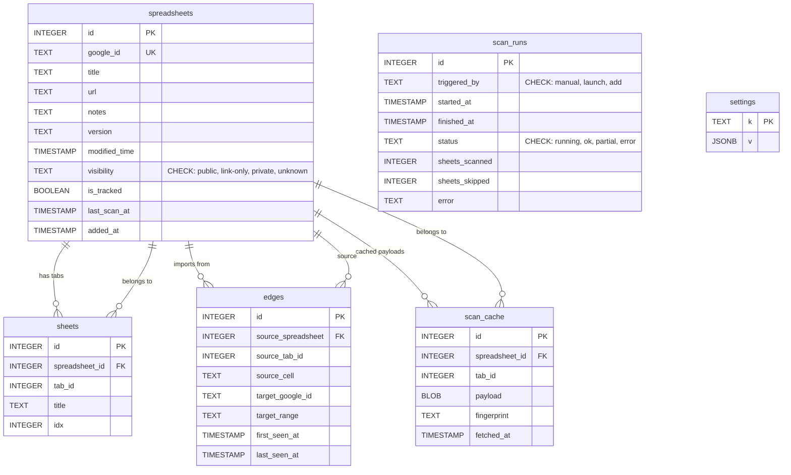

# SheetTracer Database

Turso/libSQL, opened via `turso.tech/database/tursogo` (pure Go, no CGO — uses purego for FFI). The DB lives in the OS user-data dir (`os.UserConfigDir()/SheetTracer/sheetTracer.db`). WAL mode is enabled for concurrent reads during parallel scans.

## Driver rationale

- `tursogo` is built on the Turso Database engine — a ground-up rewrite of SQLite with concurrent writes (MVCC), async I/O, and no CGO required.
- Pure Go via purego — no cross-compile pain on any target (see `docs/CI.md`).
- Drop-in `database/sql` interface — same API as the previous `modernc.org/sqlite` driver.
- Future option: embedded replicas for cloud sync (local reads + writes, push/pull to Turso Cloud).

## Connection settings

- WAL mode (`PRAGMA journal_mode = WAL`)
- `busy_timeout = 5000` for single-writer contention
- `foreign_keys = ON`
- `synchronous = NORMAL` (durability tradeoff is fine — graphs can be re-scanned)
- File perms: data dir created `0700`, db file `chmod 0600` after opening — the only user who can read the DB is the owning OS user

## Schema

### Entity-relationship diagram



### Tables

```sql
-- Tracked spreadsheets (graph nodes at file level)
CREATE TABLE spreadsheets (
    id              INTEGER PRIMARY KEY,
    google_id       TEXT NOT NULL UNIQUE,
    title           TEXT NOT NULL,
    url             TEXT NOT NULL,
    notes           TEXT NOT NULL DEFAULT '',
    version         TEXT,
    modified_time   TIMESTAMP,
    visibility      TEXT NOT NULL DEFAULT 'private'
                    CHECK (visibility IN ('public', 'link-only', 'private', 'unknown')),
    is_tracked      BOOLEAN NOT NULL DEFAULT 1,
    last_scan_at    TIMESTAMP,
    added_at        TIMESTAMP NOT NULL DEFAULT CURRENT_TIMESTAMP
);

-- Tabs within a workbook (metadata, not graph nodes)
CREATE TABLE sheets (
    id              INTEGER PRIMARY KEY,
    spreadsheet_id  INTEGER NOT NULL REFERENCES spreadsheets(id) ON DELETE CASCADE,
    tab_id          INTEGER NOT NULL,
    title           TEXT NOT NULL,
    idx             INTEGER,
    UNIQUE (spreadsheet_id, tab_id)
);

-- Import dependencies (graph edges), one row per IMPORTRANGE formula.
-- Edge width on the graph = COUNT(*) per (source_spreadsheet, target_google_id).
CREATE TABLE edges (
    id                   INTEGER PRIMARY KEY,
    source_spreadsheet   INTEGER NOT NULL REFERENCES spreadsheets(id) ON DELETE CASCADE,
    source_tab_id        INTEGER NOT NULL,       -- Google sheetId of the tab containing the formula
    source_cell          TEXT NOT NULL,           -- cell reference, e.g. 'B3'
    target_google_id     TEXT NOT NULL,           -- spreadsheetId parsed from IMPORTRANGE url
    target_range         TEXT,                    -- e.g. 'Sheet1!A1:C10'
    first_seen_at        TIMESTAMP NOT NULL DEFAULT CURRENT_TIMESTAMP,
    last_seen_at         TIMESTAMP NOT NULL DEFAULT CURRENT_TIMESTAMP,
    UNIQUE (source_spreadsheet, source_tab_id, target_google_id, target_range)
);
CREATE INDEX idx_edges_source ON edges(source_spreadsheet);
CREATE INDEX idx_edges_target ON edges(target_google_id);
CREATE INDEX idx_edges_pair ON edges(source_spreadsheet, target_google_id);

-- Raw fetched payloads, compressed, so rescans are incremental and memory-light
CREATE TABLE scan_cache (
    id             INTEGER PRIMARY KEY,
    spreadsheet_id INTEGER NOT NULL REFERENCES spreadsheets(id) ON DELETE CASCADE,
    tab_id         INTEGER,
    payload        BLOB NOT NULL,
    fingerprint    TEXT,
    fetched_at     TIMESTAMP NOT NULL DEFAULT CURRENT_TIMESTAMP,
    UNIQUE (spreadsheet_id, tab_id)
);

-- One row per scan run
CREATE TABLE scan_runs (
    id             INTEGER PRIMARY KEY,
    triggered_by   TEXT NOT NULL CHECK (triggered_by IN ('manual', 'launch', 'add')),
    started_at     TIMESTAMP NOT NULL,
    finished_at    TIMESTAMP,
    status         TEXT NOT NULL CHECK (status IN ('running', 'ok', 'partial', 'error')),
    sheets_scanned INTEGER NOT NULL DEFAULT 0,
    sheets_skipped INTEGER NOT NULL DEFAULT 0,
    error          TEXT
);

-- Key/value store: non-secret preferences and last app state.
-- Secrets (the OAuth refresh token) live in the OS keyring — see "Secrets".
-- Each key corresponds to a settings tab; value is JSONB with that tab's config.
CREATE TABLE settings (
    k TEXT PRIMARY KEY,
    v JSONB NOT NULL DEFAULT '{}'
);
```

## Type reference

| SQL type | Storage | Notes |
|---|---|---|
| `TIMESTAMP` | TEXT (ISO 8601) | Validates datetime format; `DEFAULT CURRENT_TIMESTAMP` |
| `BOOLEAN` | INTEGER (0/1) | Constrained to 0 or 1 |
| `JSONB` | BLOB (binary JSON) | Efficient binary format; use `json_extract()` for queries |
| `TEXT` | TEXT | Standard SQLite text |
| `INTEGER` | INTEGER | Standard SQLite integer |
| `BLOB` | BLOB | Raw binary (used for compressed scan payloads) |

## Graph model

- **Node** = a row in `spreadsheets` (file-level granularity; tabs live in `sheets` as metadata).
- **Node visibility** (`spreadsheets.visibility`) is derived from Drive permissions during `files.get` (`type='anyone'` → `public`, `type='anyoneWithLink'` → `link-only`, otherwise `private`). An external target we can't access resolves to `unknown` (Drive returns 404 `notFound` for both "no access" and "doesn't exist" — see `docs/SCANNING.md`).
- **Edge** = one or more rows in `edges` sharing the same `(source_spreadsheet, target_google_id)`. Each row is a single IMPORTRANGE formula with its cell location.
- **Edge width** (drives visual thickness in the graph UI) = count of formulas per source-target pair:

```sql
SELECT source_spreadsheet, target_google_id, COUNT(*) AS formula_count
FROM edges
GROUP BY source_spreadsheet, target_google_id;
```

- **Fan-in** (drives node sizing) = count of inbound edges per target spreadsheet:

```sql
SELECT target_google_id, COUNT(*) AS fan_in
FROM edges
GROUP BY target_google_id;
```

- **Open in Google Sheets** — construct a URL from the edge's source location:

```
{spreadsheets.url}?gid={source_tab_id}#gid={source_tab_id}&range={source_cell}
```

## Edge lifecycle (scan merge)

A scan merge is the only writer during a run:

1. **Delete** all edges belonging to scanned workbooks (clear the slate).
2. **Insert** each extracted edge — fresh `first_seen_at`, `last_seen_at = CURRENT_TIMESTAMP`.
3. Rewrite `scan_cache` blobs for changed tabs; drop unchanged entries.
4. Update `spreadsheets.version` / `modified_time` / `visibility` (permissions from the same `files.get`).

> Note: sharing changes don't reliably bump the Drive `version`, so `visibility` is refreshed on every scan (preflight always re-reads `files.get`), not pushed instantly.

## Migrations

Hand-rolled runner in `internal/db/migrate.go` (no framework):

- Migration files live in `internal/db/migrations/`, named `NNNN_description.sql` (`0001_init.sql`), embedded via `embed.FS`.
- The version counter is `PRAGMA user_version` — a scalar, bumped atomically in the same transaction that applies the migration, so a crash can never leave a half-applied migration.
- Applied at startup, **forward-only and up-only** (no down migrations): the rollback path is the backup below, not a down migration.
- **Safety guard:** if the on-disk `user_version` is *higher* than this binary knows, the app refuses to start ("created by a newer version of SheetTracer") rather than risk an old build writing to an unknown schema.
- **Auto-backup:** before the first pending migration, a copy is written via `VACUUM INTO` to `<db>.pre-upgrade.db` (replacing the previous backup). Rollback = stop the app, restore that file.

### Migration discipline (no data loss)

- **Additive changes only**: new tables, `ADD COLUMN`, new indexes never touch existing rows — safe by construction.
- Semantic changes: add the new column → backfill → drop the old one. Never mutate meaning in place.
- Structural changes (PK/constraint edits): table-rewrite pattern (`CREATE TABLE new; INSERT SELECT; DROP old; RENAME`) inside the migration tx. `foreign_keys` is per-connection, so handle it explicitly during rewrites.

## Secrets

The OAuth refresh token is the only secret the app stores, and it does **not** live in SQLite — it goes to the **OS keyring** via `internal/keyring` (macOS Keychain, Windows Credential Manager, Linux Secret Service), item keys `oauth.refresh_token` / `oauth.token`. `settings` holds only non-secret preferences and last app state.

- Keyring dependency: `99designs/keyring`. Its macOS backend (Keychain) uses cgo; Linux (Secret Service, via DBus) and Windows (wincred) do not. This is the one place the app needs cgo on macOS, and it does not affect the CGO-free database decision.
- **Fallback:** if the system keyring is unreachable (headless Linux, CI, locked keyring), `internal/keyring` falls back to an unencrypted file backend (`FilePasswordFunc` static passphrase that ships in the binary — obfuscation only, never a trusted secret store). `Store.UseFallback()` reports the degraded mode so the UI can warn.
- The data directory is created `0700` and the db file `0600` so even the database side is only readable by the owning user.

## Backup

Single `.db` file is trivially copyable. WAL sidecar files (`.db-wal`, `.db-shm`) exist during runtime — back up via a clean checkpoint or `VACUUM INTO` if needed.
